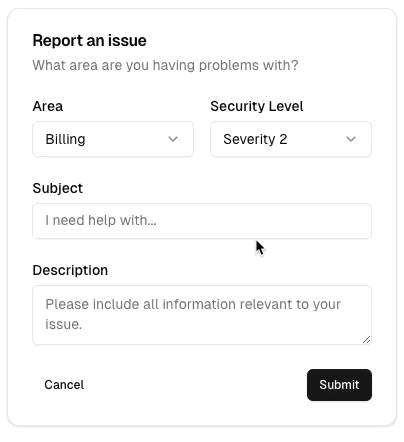

- **总是**用**中文**回复和生成 git 提交信息，代码（包括 UI）只用**英文**编写

Always use Tidewave's tools for evaluating code, querying the database, etc.

Use `get_docs` to access documentation and the `get_source_location` tool to
find module/function definitions.

# Vmemo 是一个使用 **Phoenix** **LiveView** **Ash** **Oban** 编写的 Web 应用

## Elixir Phoenix LiveView 基本约定

参见 `docs/coding-guidelines/elixir-phoenix-liveview.md`

## 个人规范

- **总是**采用文档驱动开发，创建 `docs/devlog/YYYYMMDD-title.md` 并记录开发日志
- 代码、注释、UI 文本一律使用 **英文**，不混用中文；只在文档或沟通中使用中文
- **绝不**使用 i18n，代码中始终直接使用英文文本
- **绝不**写过多注释，保持代码简洁易懂
- **绝不**运行 `build` 和 `start` 命令，除非我要求，大多数情况下代码支持热替换
- 当在对话中约定/发现新的 coding guideline 时，**必须及时在本文件中更新对应规范**（必要时再拆到 `docs/coding-guidelines/**`），避免规范只存在于对话里

## Web 应用规范

- **绝不**在表单或操作失败时导航，应该显示错误消息
- **绝不**在表单验证失败时丢失或修改用户输入
- **总是**在操作附近显示消息
  - 表单错误消息应该在表单附近
  - 按钮错误消息应该在按钮附近
- External Services / Healthcheck
  - **不要默认自动调用外部服务的 healthcheck**，应提供显式的「Test」或类似按钮，由用户主动触发
  - healthcheck 调用要尽量轻量、幂等，可以使用最小真实数据（如小图片）验证端到端链路
  - healthcheck 仅负责「是否可用」判断，不在 UI 中暴露底层 REST 细节（HTTP 拼接、headers 等）

## UI/UX 规范

- 设计参考 shadcn/ui 并进行风格微调
- library 使用 daisyUI

### Button

> 少即是多。

样式（颜色）

1. 默认：outline
2. 提交、保存：accent color
3. 危险操作：error color

- 表单的保存和取消按钮
  - 保存：primary
  - 取消：ghost

shadcn/ui 表单取消按钮是 ghost 按钮。



### Dropdown Menu

- **总是**对下拉菜单使用 `shadow-lg` 阴影

  - **原因**：提供清晰的视觉分离和深度感，使下拉菜单看起来浮在页面内容之上
  - **示例**：`class="dropdown-content menu bg-base-100 rounded-box z-[1] w-52 p-2 shadow-lg border border-base-300"`

- **总是**使用分隔线来分隔菜单组
  - **何时使用**：将相关的菜单项分组，并将破坏性操作（如登出、删除）与其他操作分开
  - **实现方式**：使用 `<li class="border-t border-base-300 my-1"></li>` 作为分隔线
  - **原因**：提供清晰的视觉分组，防止菜单项的阴影与分隔线重叠
  - **示例**：在用户菜单中的 "Settings/Tokens" 和 "Logout" 之间放置分隔线

### Image

- **总是**使用 Tailwind CSS 类指定宽度和高度（例如 `w-12 h-12` 或 `size-12`）
- **绝不**使用 HTML `width` 或 `height` 属性
- **原因**：防止图片加载缓慢时的布局偏移和闪烁
- **示例**：使用 `class="w-12 h-12"` 而不是 `class="h-12" height="48"`

### Spacing

- **表单字段间距**：表单字段之间使用 `space-y-2` (8px)

  - **原因**：在相关的表单元素之间提供一致且紧凑的间距
  - **示例**：`simple_form` 组件内部使用 `space-y-2`

- **表单字段到按钮间距**：表单字段和操作按钮之间使用 16px 间距

  - **实现方式**：`simple_form` 组件使用 `space-y-2` (8px) + actions div `py-2` (8px padding top) = 总共 16px
  - **原因**：在输入字段和操作之间提供清晰的视觉分离

- **外部操作到表单间距**：外部操作按钮（如下拉菜单）和表单内容之间使用 `pt-2` (8px)
  - **原因**：保持一致的间距层次结构

### List

- **总是**默认按 `inserted_at`（创建时间）排序列表，而不是 `updated_at`
- **原因**：基于创建时间提供一致且可预测的排序
- **示例**：在 Ash read actions 中使用 `prepare build(default_sort: [inserted_at: :desc])`

## Elixir 规范

- Elixir 具有**模式匹配**特性
- 公共 utils 模块（尤其是纯函数的 helper）**必须**有测试和文档：
  - `@moduledoc` 只做模块 summary，每个公开函数都写独立 `@doc`，并尽量附带 doctest example
  - 在 `test/**` 下为每个 utils 模块添加对应的 `doctest` 或单元测试文件

## 数据与 Utils 规范

- **时间 / 时区**
  - 所有 UI 展示的时间必须与**用户的时区**保持一致（例如从用户配置或浏览器上报的 timezone 推导），不能直接展示服务器时区
  - 内部计算可以使用 UTC，但最终展示前必须转换到用户时区
  - 数据交换（API、JSON、日志等）**一律使用 ISO8601 datetime 字符串**（包含时区或 `Z`）
  - 统一通过 `VmemoWeb.Utils.Datetime` 之类的顶级 utils 模块处理时间：
    - `now_iso_datetime/0`：按配置的 `:vmemo, :time_zone` 生成当前时间（ISO8601）
    - `format_*`：只做纯粹的格式化，不嵌在 LiveView / Component 中

- **Utils 组织**
  - 公共数据格式化逻辑（datetime、number、money 等）**不要散落在 UI 模块附近**
  - 优先放在顶级 `VmemoWeb.Utils.*` 或 `Vmemo.Utils.*` 模块下，按领域细分：
    - `VmemoWeb.Utils.Datetime`、`VmemoWeb.Utils.Number`、`VmemoWeb.Utils.Money` 等
  - LiveView / LiveComponent 中只调用 utils，不直接硬编码格式规则

## API / SDK 规范

- REST API request / response 处理逻辑应该封装在 **SDK 模块** 中（如 `SmallSdk.*`），而不是在业务逻辑里临时拼装 `Req` / `curl` 请求
- 业务代码只调用 SDK 暴露的函数（如 `SmallSdk.Moondream.caption/2`），不关心 base_url、headers、stream 选项等细节
- 当需要新的外部接口能力时，优先扩展 SDK，再在业务层使用，保持调用点简单、可替换
- 外部服务地址、密钥等环境相关配置应优先通过 `config/runtime.exs` 覆盖，避免只在 `dev.exs` / `test.exs` 中写死导致环境变更不生效
- **不要**在代码中编写 env 格式兼容或自动修正逻辑；只需要约定好 env 格式
- 如果 env 不合法（缺失、格式错误、无效值），应**直接报错**，不要静默兜底或推断修复

## Ash 规范

- 使用 **Ash** 而不是 **Ecto**
- **总是**对模型中的枚举/状态字段使用 `:string` + `validations`
  - 优势：修改枚举值不需要数据库迁移，不需要数据库锁
  - 示例：使用 `attribute :status, :string` 并验证允许的值

**mix 规范**

- 通过 `mix phx.routes` 获取路由
- 总是使用 `mix` 运行脚本

**Phoenix 规范**

- **绝不**为 LiveView 创建 `.heex` 文件，在 **render()** 中编写 HTML
  - Phoenix 可以使用 `<.link method="delete">` 调用服务器函数
- LiveView 可以使用 `push_event` 触发客户端事件
- 在 LiveView `handle_event/3` 中，优先通过小的 helper（例如 `update_service/3`）处理特定 id/name，而不是在函数体内直接写复杂的 `Enum.map`/`case`；保持事件处理函数短小、语义清晰

- **总是**对 LiveView 事件名称使用 **kebab-case**（在 `handle_event` 和 `phx-*` 属性中都是如此）

  - 示例：`handle_event("send-message", ...)` 和 `phx-submit="send-message"`
  - 这提供了与 HTML 属性命名约定的一致性

- **总是**使用 [LiveView 内置上传功能](https://hexdocs.pm/phoenix_live_view/uploads.html) 进行文件上传

- **组件组织**：

  - **总是**在以下情况下将复杂的 UI 逻辑拆分为 LiveComponents：
    - 单个文件超过约 500 行
    - UI 部分具有独立的状态和事件处理
    - 组件可以在多个地方重用
  - **保持组件专注**：每个组件应该处理单一职责
  - **组件通信**：当组件需要更新父级状态时，使用 `send(self(), {:event, data})` 通知父级 LiveView
  - **文件位置**：
    - `core_component` 用于无状态组件，Phoenix.Component
    - `live/components` 用于有状态组件，Phoenix.LiveComponent

- **绝不**使用 SurfaceUI
  - **原因**：配置过于复杂，容易设置错误，在 liveview 升级后必须升级，影响构建、配置、Dockerfile 和 Docker 镜像大小。LiveView 已经足够好，SurfaceUI 是成本

**PostgreSQL 规范**

- **不要**使用 `LIKE` 操作符！使用 Postgres 内置的**全文搜索**查询
- **总是**使用 `uuidv7`

**数据同步**

- **数据库**：立即更新（同步）
- **Typesense**：通过 Oban 作业异步更新

**异步任务规范**

- **总是**对耗时操作使用异步设计（Oban job + PubSub）
  - **何时使用**：任何可能耗时超过几秒的操作（如 AI 生成、文件处理、数据同步等）
  - **实现方式**：参考 `docs/coding-guidelines/background-jobs-with-pubsub.md` 了解详细实现指南
  - **优点**：
    - 用户可以异步确认任务结果，无需等待
    - 在网络不好的环境下也可以使用功能
    - 可以避免 socket 连接失败导致任务失败
    - 用户离开页面后任务仍能继续执行
  - **示例**：Caption 生成、Moondream 请求、需要处理的文件上传

**git 规范**

- **总是**生成简单的 git 提交信息，使用 `feat(scope):` `fix(scope):` `chore(scope):` 作为前缀
- **绝不**提交 `.playwright-mcp/*`

**代码格式**

- 永远不要删除 HTML class 中的**空格**


**本地调试和测试规范**

- **优先**使用**真实数据**和**UI**进行测试
- **总是**在 `Upload` 测试中使用 `test/testdata_files/**` 中的真实文件
- 测试 UI 时**总是**保存截图记录测试过程（例如 Playwright 截图）
- UI 测试**优先**使用 visual testing 方法
- e2e / UI visual testing **总是**优先使用 Playwright 的 screenshot snapshot 断言（例如 `expect(page).toHaveScreenshot()`、`expect(locator).toHaveScreenshot()`），而不是只做肉眼查看或仅保存临时截图
- Playwright visual testing 的 baseline snapshots **必须**提交到仓库，保证本地与 CI 都能做稳定对比；临时调试截图仍可额外保存到 `/tmp` 或 `test-results/`
- visual testing 的团队协作基准 **总是**以 CI 中的 prod-like 运行结果为准；本地 dev server 运行只用于个人调试，不作为团队共享的通过/失败判定标准
- 这里的“快照”指 **Playwright visual snapshots**；它不同于 DOM snapshot。项目仍然**优先**保留真实截图和视觉对比，不依赖 DOM 结构快照
- visual testing **总是**至少覆盖两种 viewport：`iPhone SE` 和 `MacBook 13` size；同一套页面视觉 spec 应在这两个尺寸下运行
- Playwright page-level e2e testing **总是**采用一个页面一个 `*.spec.ts` 文件，不要把多个页面定义在同一个路由数组里批量生成
- visual testing **不要**单独维护独立测试体系；应直接集成在对应页面的 e2e `*.spec.ts` 中，在页面渲染与交互流程里顺便执行 screenshot snapshot 断言
- visual testing CI **必须**支持两种触发方式：PR label 触发与手动 `workflow_dispatch`；手动执行只保留一个 checkbox 输入 `update_snapshots` 用于控制是否更新 snapshots
- e2e testing **必须**保持 dev / prod 独立：同一套 e2e specs 应同时支持对本地 dev server 和 prod-like Docker image 运行，不能把测试逻辑耦合到单一运行模式
- CI e2e **总是**优先运行 Docker image（生产运行方式），不要使用 `mix phx.server` 作为 CI e2e 的应用启动方式
- e2e testing 使用的 Docker Compose 配置**必须**是已提交、可独立运行的测试入口，**绝不**依赖本地临时目录（如 `_prod/`）
- GitHub Actions 中的 e2e workflow **总是**优先使用 `services` 启动 `postgres`、`typesense` 等依赖服务；应用容器可以单独使用 `docker run` 启动，避免在 CI 中再用 Docker Compose 托管整套栈
- e2e testing 默认使用 UI 模式（headed）便于人工确认，CI 环境使用 headless 模式
- e2e testing 的鉴权准备**总是**放在 Playwright `globalSetup` 或等效统一入口中，通过 storage state 复用登录态；**不要**在各个 `spec.ts` 中重复编写 register/login 逻辑
- e2e testing 的 seed / auth preparation **必须**在当前被测试的目标环境中执行：
  - 测试 dev server 时，在 dev 环境准备数据
  - 测试 prod-like container 时，在对应容器环境准备数据
- 不常用且仅 CI 需要的 e2e 准备步骤（例如 auth seed）**不要**默认耦合到本地 npm/bun scripts；应在 CI workflow 中显式执行
- e2e testing guidelines（用户视角）：
  - **总是**优先点击用户可见的按钮文本（例如 `Login` 按钮），而不是依赖 `button[type='submit']` 这类实现细节选择器
  - **总是**尽量按真实用户操作路径编写测试步骤（从用户能看到和能点击的元素出发）
  - 选择器优先级：可见文本/ARIA role > label > test id > CSS 实现细节

你可以在本地使用测试账号

```
email = "test@example.com"
password = "password123456"
```

## 项目规范

- **版本管理**：本项目使用 `mise` 进行 Elixir/Erlang 版本管理。`mise.toml` 文件指定了所需的版本。设置项目时，运行 `mise install` 自动安装正确的版本。
- 每次从没有 diff 的状态开始写代码时，先创建一个新的 branch，不要直接在 `develop` 或 `main` 上开始工作。
- 每次 commit 都应该只提交独立的功能，不要在一个 commit 中混合过多不同的修改。

## Tools

- `mise` 用于版本管理（Elixir, Erlang）。项目使用 `mise.toml` 文件指定版本。**总是**使用 mise 管理 Elixir/Erlang 版本，不要使用 Homebrew 或其他包管理器
- `Tidewave` 是全栈 Web 应用开发的编码代理，深度集成 Phoenix，从数据库到 UI
- `Context7` MCP 拉取最新的、特定版本的文档和代码示例
- `Playwright` 与网页交互；做 UI/e2e visual testing 时优先使用**截图型快照**（visual snapshots），不要把它和 DOM snapshot 混淆
- **绝不**使用 `python` 运行脚本
- 可以使用 `curl` `jq` `gh` 等
