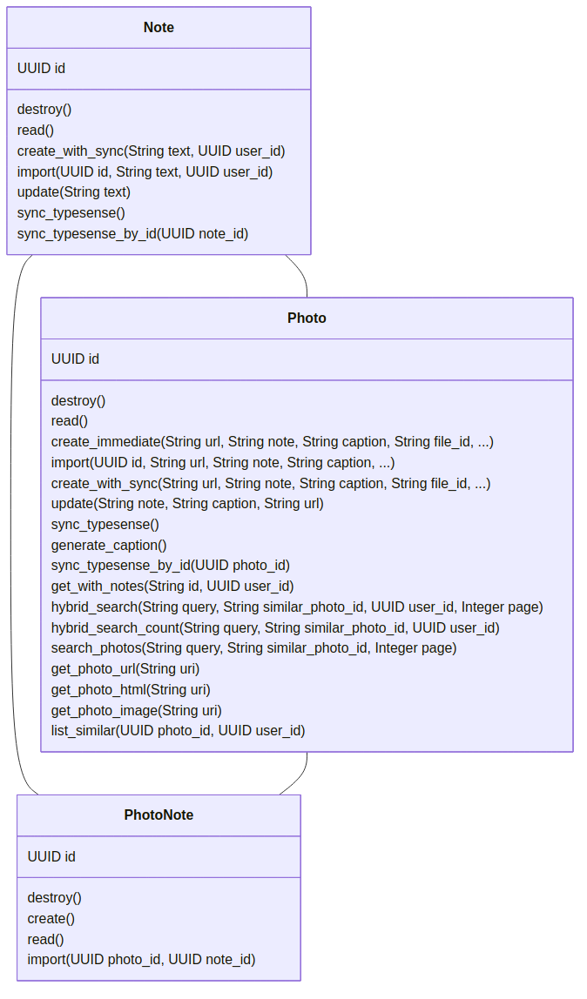
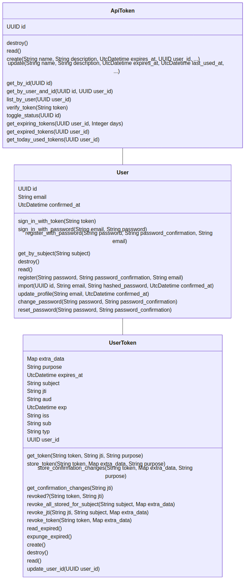
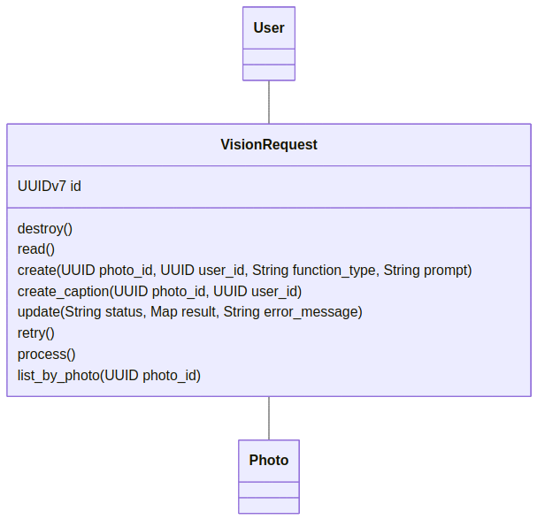
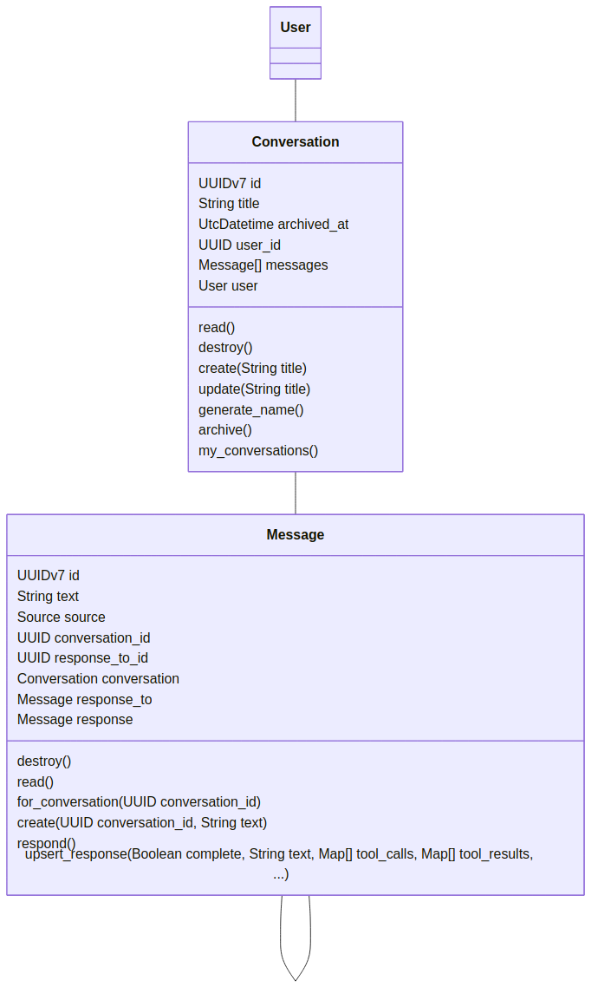
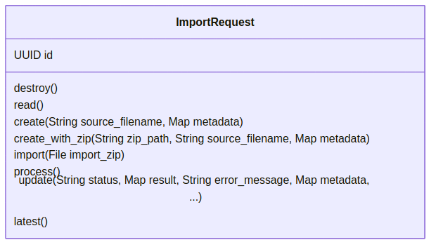

# Architecture Diagrams

Ash resource diagrams (PNG) are generated in CI with
[`mix ash.generate_resource_diagrams`](https://hexdocs.pm/ash/Mix.Tasks.Ash.GenerateResourceDiagrams.html)
and published under `docs/guides/development/ash/`.

## Preview

| Domain  | Resource diagram (PNG)                                    |
| ------- | --------------------------------------------------------- |
| Memo    |        |
| Account |  |
| AI      |            |
| Chat    |        |
| Admin   |      |
