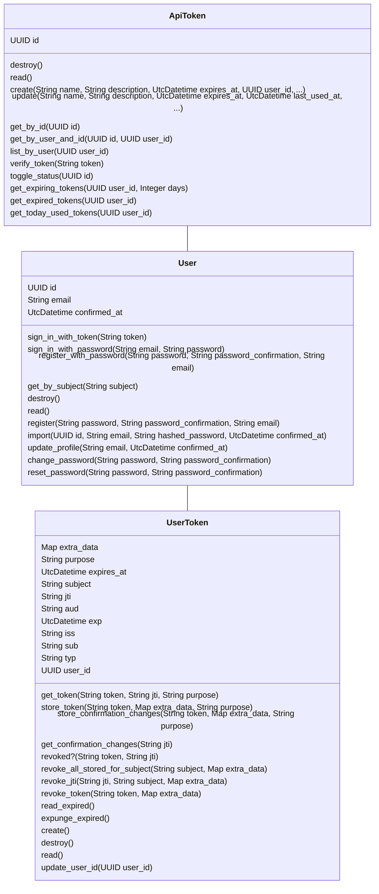

```mermaid
classDiagram
    class User {
        UUID id
        String email
        UtcDatetime confirmed_at
        sign_in_with_token(String token)
        sign_in_with_password(String email, String password)
        register_with_password(String password, String password_confirmation, String email)
        get_by_subject(String subject)
        destroy()
        read()
        register(String password, String password_confirmation, String email)
        import(UUID id, String email, String hashed_password, UtcDatetime confirmed_at)
        update_profile(String email, UtcDatetime confirmed_at)
        change_password(String password, String password_confirmation)
        reset_password(String password, String password_confirmation)
    }
    class UserToken {
        Map extra_data
        String purpose
        UtcDatetime expires_at
        String subject
        String jti
        String aud
        UtcDatetime exp
        String iss
        String sub
        String typ
        UUID user_id
        get_token(String token, String jti, String purpose)
        store_token(String token, Map extra_data, String purpose)
        store_confirmation_changes(String token, Map extra_data, String purpose)
        get_confirmation_changes(String jti)
        revoked?(String token, String jti)
        revoke_all_stored_for_subject(String subject, Map extra_data)
        revoke_jti(String jti, String subject, Map extra_data)
        revoke_token(String token, Map extra_data)
        read_expired()
        expunge_expired()
        create()
        destroy()
        read()
        update_user_id(UUID user_id)
    }
    class ApiToken {
        UUID id
        destroy()
        read()
        create(String name, String description, UtcDatetime expires_at, UUID user_id, ...)
        update(String name, String description, UtcDatetime expires_at, UtcDatetime last_used_at, ...)
        get_by_id(UUID id)
        get_by_user_and_id(UUID id, UUID user_id)
        list_by_user(UUID user_id)
        verify_token(String token)
        toggle_status(UUID id)
        get_expiring_tokens(UUID user_id, Integer days)
        get_expired_tokens(UUID user_id)
        get_today_used_tokens(UUID user_id)
    }

    ApiToken -- User
    User -- UserToken

```
