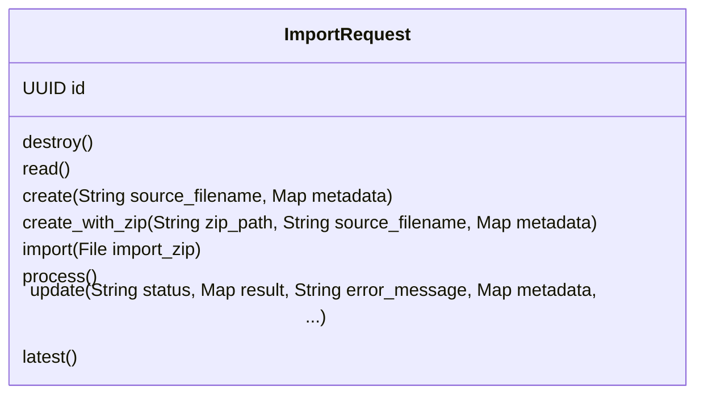

```mermaid
classDiagram
    class ImportRequest {
        UUID id
        destroy()
        read()
        create(String source_filename, Map metadata)
        create_with_zip(String zip_path, String source_filename, Map metadata)
        import(File import_zip)
        process()
        update(String status, Map result, String error_message, Map metadata, ...)
        latest()
    }


```
