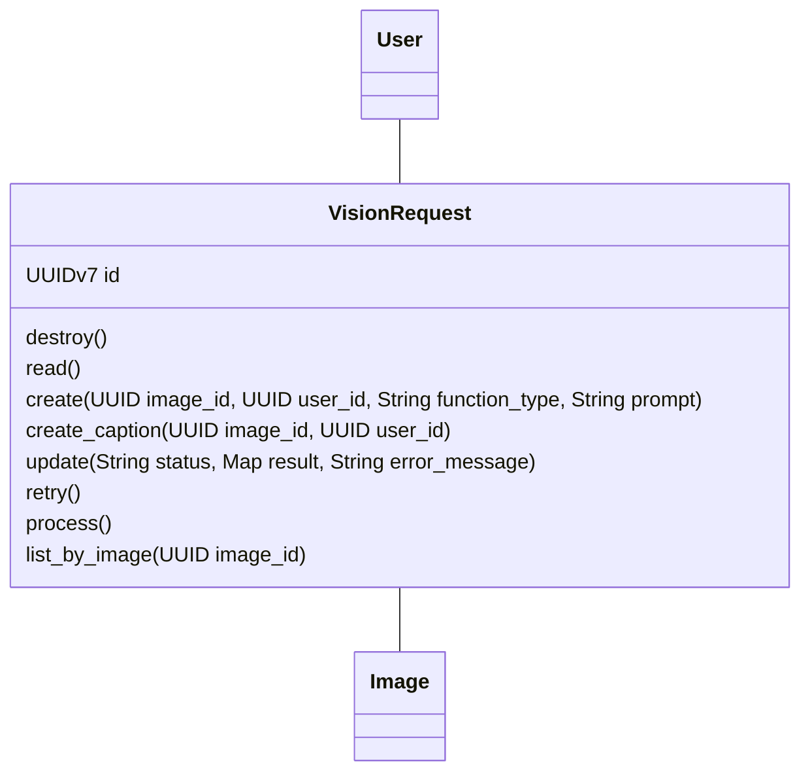

```mermaid
classDiagram
    class VisionRequest {
        UUIDv7 id
        destroy()
        read()
        create(UUID image_id, UUID user_id, String function_type, String prompt)
        create_caption(UUID image_id, UUID user_id)
        update(String status, Map result, String error_message)
        retry()
        process()
        list_by_image(UUID image_id)
    }

    User -- VisionRequest
    VisionRequest -- Image

```
