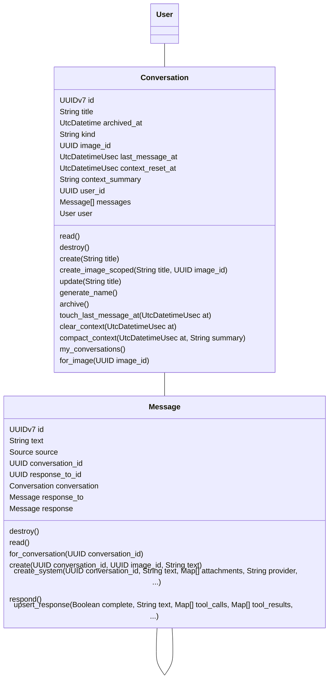

```mermaid
classDiagram
    class Conversation {
        UUIDv7 id
        String title
        UtcDatetime archived_at
        String kind
        UUID image_id
        UtcDatetimeUsec last_message_at
        UtcDatetimeUsec context_reset_at
        String context_summary
        UUID user_id
        Message[] messages
        User user
        read()
        destroy()
        create(String title)
        create_image_scoped(String title, UUID image_id)
        update(String title)
        generate_name()
        archive()
        touch_last_message_at(UtcDatetimeUsec at)
        clear_context(UtcDatetimeUsec at)
        compact_context(UtcDatetimeUsec at, String summary)
        my_conversations()
        for_image(UUID image_id)
    }
    class Message {
        UUIDv7 id
        String text
        Source source
        UUID conversation_id
        UUID response_to_id
        Conversation conversation
        Message response_to
        Message response
        destroy()
        read()
        for_conversation(UUID conversation_id)
        create(UUID conversation_id, UUID image_id, String text)
        create_system(UUID conversation_id, String text, Map[] attachments, String provider, ...)
        respond()
        upsert_response(Boolean complete, String text, Map[] tool_calls, Map[] tool_results, ...)
    }

    User -- Conversation
    Conversation -- Message
    Message -- Message

```
