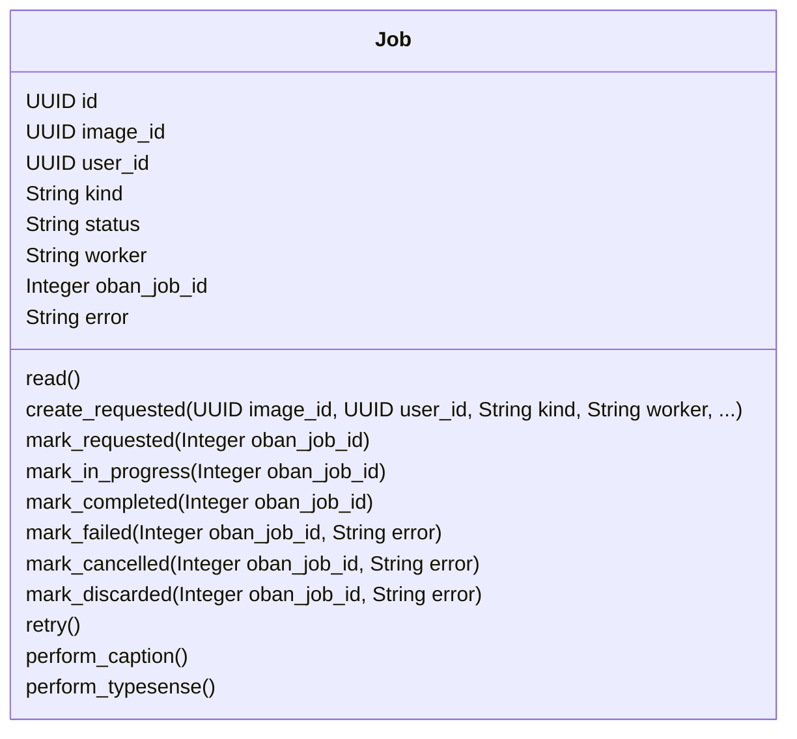

```mermaid
classDiagram
    class Job {
        UUID id
        UUID image_id
        UUID user_id
        String kind
        String status
        String worker
        Integer oban_job_id
        String error
        read()
        create_requested(UUID image_id, UUID user_id, String kind, String worker, ...)
        mark_requested(Integer oban_job_id)
        mark_in_progress(Integer oban_job_id)
        mark_completed(Integer oban_job_id)
        mark_failed(Integer oban_job_id, String error)
        mark_cancelled(Integer oban_job_id, String error)
        mark_discarded(Integer oban_job_id, String error)
        retry()
        perform_caption()
        perform_typesense()
    }


```
