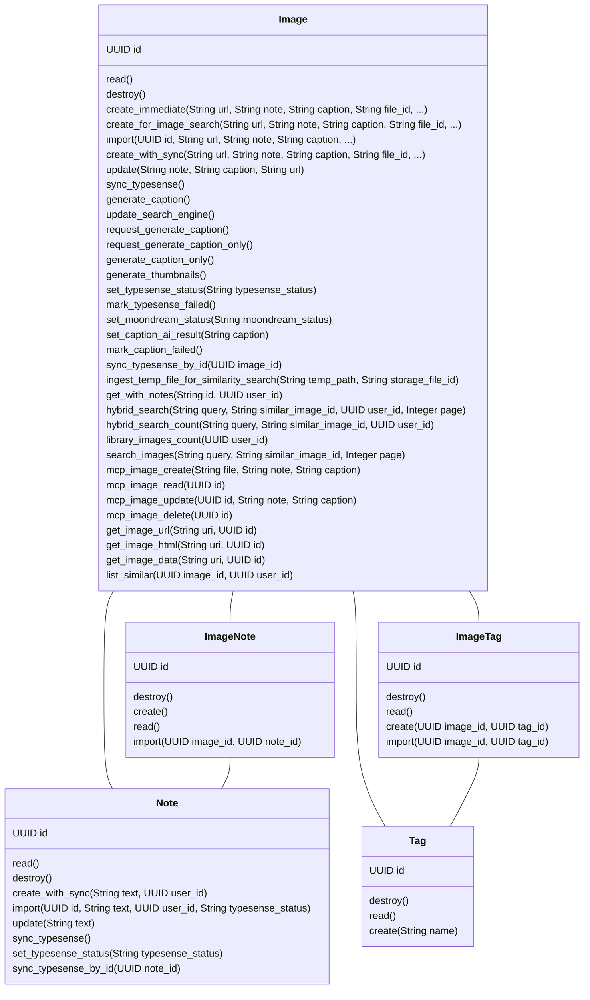

```mermaid
classDiagram
    class Image {
        UUID id
        read()
        destroy()
        create_immediate(String url, String note, String caption, String file_id, ...)
        create_for_image_search(String url, String note, String caption, String file_id, ...)
        import(UUID id, String url, String note, String caption, ...)
        create_with_sync(String url, String note, String caption, String file_id, ...)
        update(String note, String caption, String url)
        sync_typesense()
        generate_caption()
        update_search_engine()
        request_generate_caption()
        request_generate_caption_only()
        generate_caption_only()
        generate_thumbnails()
        set_typesense_status(String typesense_status)
        mark_typesense_failed()
        set_moondream_status(String moondream_status)
        set_caption_ai_result(String caption)
        mark_caption_failed()
        sync_typesense_by_id(UUID image_id)
        ingest_temp_file_for_similarity_search(String temp_path, String storage_file_id)
        get_with_notes(String id, UUID user_id)
        hybrid_search(String query, String similar_image_id, UUID user_id, Integer page)
        hybrid_search_count(String query, String similar_image_id, UUID user_id)
        library_images_count(UUID user_id)
        search_images(String query, String similar_image_id, Integer page)
        mcp_image_create(String file, String note, String caption)
        mcp_image_read(UUID id)
        mcp_image_update(UUID id, String note, String caption)
        mcp_image_delete(UUID id)
        get_image_url(String uri, UUID id)
        get_image_html(String uri, UUID id)
        get_image_data(String uri, UUID id)
        list_similar(UUID image_id, UUID user_id)
    }
    class Note {
        UUID id
        read()
        destroy()
        create_with_sync(String text, UUID user_id)
        import(UUID id, String text, UUID user_id, String typesense_status)
        update(String text)
        sync_typesense()
        set_typesense_status(String typesense_status)
        sync_typesense_by_id(UUID note_id)
    }
    class ImageNote {
        UUID id
        destroy()
        create()
        read()
        import(UUID image_id, UUID note_id)
    }
    class Tag {
        UUID id
        destroy()
        read()
        create(String name)
    }
    class ImageTag {
        UUID id
        destroy()
        read()
        create(UUID image_id, UUID tag_id)
        import(UUID image_id, UUID tag_id)
    }

    Image -- ImageNote
    Image -- ImageTag
    Image -- Note
    Image -- Tag
    ImageNote -- Note
    ImageTag -- Tag

```
