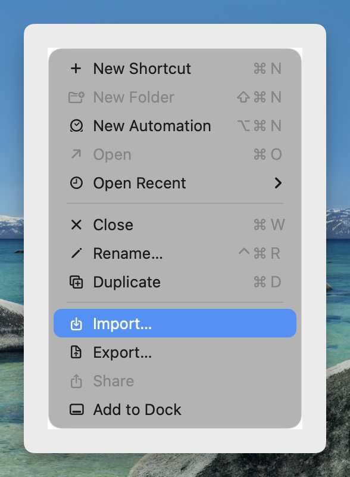
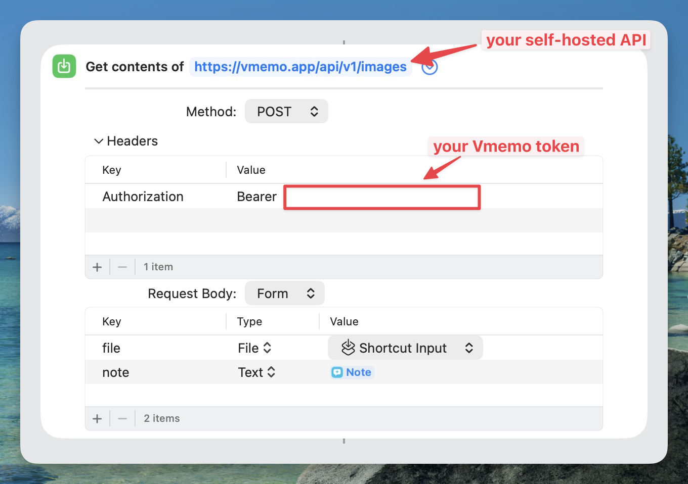

# Apple Shortcuts Integration for Vmemo

Use this shortcut to quickly send text into Vmemo from iPhone, iPad, or macOS.

## What You Need

- A running Vmemo instance
- A valid Vmemo API token
- Network access from your Apple device to the Vmemo server

## Import the Shortcut

1. Open the Shortcuts app on your Apple device.
2. Import [`Send to Vmemo.shortcut`](./Send%20to%20Vmemo.shortcut).
3. Confirm the import when prompted.

## Configure the Shortcut

After import, open the shortcut details and set the required values:

- `Base URL`: Your Vmemo server address (for example `https://your-vmemo.example.com`)
- `API Token`: Your Vmemo access token
- Optional fields if present in your shortcut version:
- `Default Source`: The source label written to Vmemo
- `Default Tags`: Comma-separated tags

## How to Use

1. Run the shortcut from Shortcuts app, Share Sheet, Siri, or Home Screen.
2. Input or share the text you want to save.
3. Wait for the success message from the shortcut.

## Quick Verification

- Open Vmemo and confirm the new memo appears.
- Check that source/tags match your shortcut config.

## Troubleshooting

- `Unauthorized` or `401`: API token is missing, invalid, or expired.
- `Not Found` or `404`: Base URL is incorrect or server route is unavailable.
- Timeout or no response: Check network/VPN and server status.
